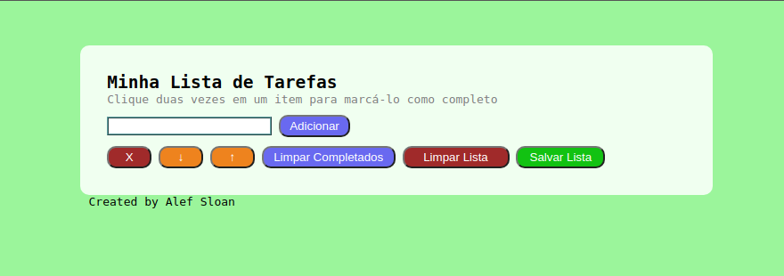

<h1 align="center">Welcome to todo-list 👋</h1>
<p>
  <a href="https://www.npmjs.com/package/todo-list" target="_blank">
    
  </a>
  <a href="#" target="_blank">
    
  </a>
</p>

> This is a simple todo list project. Made with pure HTML, CSS and Javascript just for learning.


## Screenshots




## Demonstração

Link for todo-list:

https://todo-list-livid-two.vercel.app/


## Funcionalidades

- Create tasks
- Select and mark completed tasks
- Change tasks order
- Save the list locally for future access
- Delete completed tasks or clear task list completely
## Rodando localmente

Git clone repository

```bash
  git clone git@github.com:AlefSloan/todo-list.git
```

Cd to project folder

```bash
  cd my-project
```

Install dependencies

```bash
  npm install
```

Start server

```bash
  npm start
```


## Author

👤 **Alef Sloan**

* Github: [@AlefSloan](https://github.com/AlefSloan)
* LinkedIn: [@alefsloan](https://linkedin.com/in/alefsloan)

## Suporte

For support, send an email to alef_sloan@hotmail.com.
